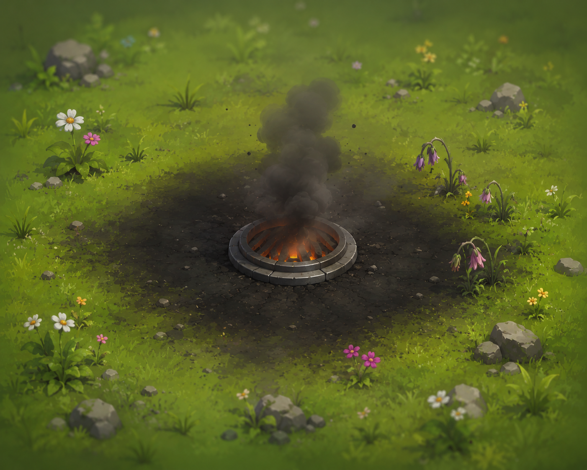
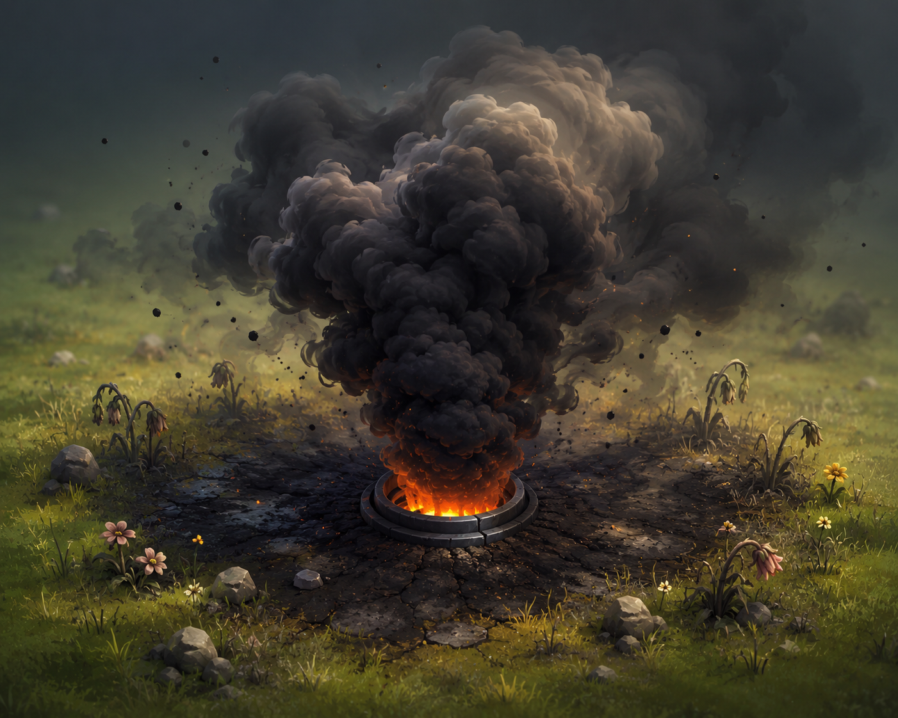

# 🌍 EcoGarden — Build Log

A behind-the-scenes log of how **EcoGarden** was built: a small web "game" where your
real-life daily choices grow — or destroy — a living 3D world. Green habits make it
flourish; high-carbon ones pollute and scorch it.

> Written as a companion for the YouTube build series. Each phase is roughly one
> "episode" of progress.

---

## 🧰 Tech stack

| Layer | Choice |
|---|---|
| Framework | **Next.js 16** (App Router, Turbopack) |
| Language | **TypeScript** + **React 19** |
| Styling | **Tailwind CSS v4** |
| 2D animation / UI feedback | **Framer Motion** |
| 3D world | **Three.js** via **@react-three/fiber** + **@react-three/drei** |
| State | React `useReducer` + Context (`GameProvider`) |

---

## 🗺️ Phase 1 — The foundation (2D garden)

The first working version was a **2D emoji garden**.


<!-- Drop your screenshot of the first 2D version here as: youtube-video/images/2d-garden.png -->

- **Data model** (`lib/`): actions are presets with a `co2e` value (kg CO₂e).
  Positive = emits carbon, negative = saves it vs. a higher-carbon alternative.
- **Game state** (`lib/gameState.ts`): a reducer handling `LOG_ACTION`, `UNDO`,
  `RESET_DAY`. Each logged action adds a garden item and shifts a 0–100 **world
  health** meter.
- **UI** (`components/`): an `ActionBar` of clickable choices, a `Garden` panel,
  a `HealthMeter`, plus `StatsPanel`, `InsightsPanel`, and `ActionLog`.
- **Visuals**: each action dropped an emoji onto a grid; the sky tinted from green
  toward brown with health.

**Limitation noticed:** the feedback was too subtle. Existing plants never changed —
they were frozen at the health they were "born" with, so the world didn't visibly
react when a single choice tanked the meter.

---

## ✨ Phase 2 — Making choices *feel* impactful

Goal: when you pick an option, you should clearly **see** things get better or worse.

1. **Live-reacting plants** — introduced `itemVitality()`: each plant's look is now
   driven by *current world health*, not just its birth value. One bad choice and the
   whole garden droops, grays out, and fades together.
2. **Per-click feedback** — a floating **"±kg CO₂e" badge** shoots up on every action
   (green for good, red for bad), plus a full-scene **flash** (green / red glow).
3. **Ambient mood** — butterflies & sparkles when thriving; a brown haze and falling
   leaves when wilting.

---

## 🧊 Phase 3 — From 2D to a real-time 3D world

The emoji garden was replaced with an actual **3D scene** (`components/GardenScene3D.tsx`)
rendered with react-three-fiber, loaded client-only (no SSR) inside the existing panel.

Everything interpolates smoothly (no snapping between states) using frame-rate-independent
damping in `useFrame`:

- **Trees** grow in, recolor green→brown, shrink, and lean as health changes.
- **Ground** recolors lush green → dead brown.
- **Sky + fog** shift from clear blue to thick brown smog.
- **Sun** dims as the world dies.
- **Falling leaves** drift down below 40% health (heavier below 25%).
- **Camera** slowly auto-orbits for a "living diorama" feel.

The 2D flash + floating impact badge from Phase 2 were kept as DOM overlays on top of
the canvas.

> **Asset path for later:** the scene uses code primitives (cones, cylinders, boxes)
> today, but is structured so custom `.glb` models can drop straight in via `useGLTF`
> — the vitality-driven scale/lean/color logic stays the same.

---

## 🔥 Phase 4 — Bad actions *destroy* the world (creative impact)

Previously *every* action planted a tree — even bad ones. Now each action manifests as
the kind of harm (or good) it represents in the real world. A `WorldKind` was added to
every action:

| Kind | Looks like | Used for |
|---|---|---|
| `tree` | Full low-poly conifer | Planting a tree |
| `sprout` | Little green sprout | Low-carbon good habits |
| `smog` | Dark vent belching grey smoke | Driving, flying, AC, meat |
| `scorch` | Charred earth + dead stump + methane haze | Beef (deforestation + methane) |
| `trash` | Heap of waste cubes on scorched ground | Fast fashion / consumption |

Pollution objects **scorch the ground** beneath them and **scale with their CO₂e**
(a flight's smog column dwarfs a bus's).

---

## 🎬 Phase 5 — Scenes, routing & resilience

To document the build for the video, each milestone was preserved as its own
recordable route, and the homepage became a scene index:

| Route | Scene | What it shows |
|---|---|---|
| `/` | — | Scene menu / index |
| `/2d-garden-scene-1` | **2D · Scene 1** | The original 2D emoji garden |
| `/3d-scene-1` | **3D · Scene 1** | Basic 3D — every action grows a tree |
| `/3d-scene-2` | **3D · Scene 2** | 3D with real impact (smog/scorch/trash) |

- Added a **`basic` mode** to the 3D scene so Scene 1 (all-trees) and Scene 2
  (real impact) render from the *same* code — one prop flips the behaviour.
- Extracted the shared app layout into **`components/EcoGardenApp.tsx`** (takes a
  `badge` + `subtitle`) so every 3D scene page is a few lines.
- Added **`CanvasErrorBoundary`**: if WebGL fails in the browser, the world shows
  a clear message instead of hanging on the loading spinner.

> **Convention going forward:** each new improvement gets its own scene route
> (next up: `3d-scene-3`), and both this log and the video script grow with it.

---

## ⚔️ Phase 6 — Good vs. bad fight for the land (Scene 2)

**Problem:** objects only ever accumulated. Plant a forest, then take a flight,
and the trees sat untouched next to the smog forever — good and bad coexisted and
never interacted.

**Fix (in the reducer, `lib/gameState.ts`):** each action now clears the *opposite*
kind of object.

- A new **plant** (tree/sprout) cleans up existing **pollution** (smog/scorch/trash).
- New **pollution** razes existing **plants**.
- How many it clears scales with carbon — `clearPower = clamp(round(|co2e|/4), 1, 4)`
  — so a flight wipes out a cluster while a bus removes just one.
- The **oldest** opposing objects are removed first.
- Removed objects are stashed on the logged action (`removedItems`) so **undo**
  restores everything it destroyed.

The world now reflects your *balance*, not your entire history.

---

## 🎨 Phase 7 — Clearer pollution animations (Scene 2)

The bad-object animations were too subtle to read. Reworked them to be louder and
more alive:

- **Smoke** now **billows sideways and tumbles** as it rises (instead of going
  straight up), fading in off the base and out at the top.
- **Smog** → denser, near-**black** smoke, a taller column, and a **glowing
  orange vent mouth** so the source is obvious.
- **Beef / scorch** → added **flickering flames** and **rising glowing embers**
  (land cleared by burning) on top of the methane haze.
- **Trash** → added **buzzing flies** circling the heap and a faint **green stink
  haze** rising off it.

All driven in `useFrame`, scaled by the action's CO₂e magnitude.

---

## 🎞️ Phase 8 — Pollution polish: weighty spawns, richer loops, escalation

A big detail pass to make every bad action feel like it has physical impact.

**Spawn (all bad objects):**
- A signature **overshoot/bounce** — scale `0 → ~1.15 → 1.0` with a small random
  tilt (`easeOutBack`, ~0.5s) — so each source lands with weight.
- The **ground decal pops** in a quick dark pulse; a **dust puff** rings out on impact.

**Smog:**
- Smoke now **rolls/curls internally** and throws **occasional thicker bursts**.
- **Black ash flakes** detach and drift away.
- The vent mouth **flares bright on spawn**, then **furnace-pulses**.

**Beef / scorch:**
- The burnt **stump rises up out of the ground** with a tilt on spawn.
- Flames flicker irregularly; **embers** drift up; methane haze wobbles.

**Trash:**
- Waste cubes **drop in with a bounce** (staggered), kicking a dust puff.
- **Flies trace figure-eights**, **green methane bubbles swell & pop**, and
  **plastic scraps flutter** in the wind.

**Escalation (whole-world):**
- Smog smoke shifts **grey → near-black** as total pollution accumulates.
- Trash heaps **grow bigger** (more cubes, stronger stink) as more trash is added.

> **Honest scope:** a few spec items need shaders or art assets and were *not*
> done yet — true **heat-shimmer** distortion, real **mesh-merging** of clouds /
> scorch patches into one mass, and **per-plant proximity drooping** (pollution
> wilting only the *nearby* plants rather than via global health). Flagged for a
> later pass.

---

## 💫 Phase 9 — Framer Motion polish (UI / overlays) + a reusable skill

Installed the **`motion-framer` skill** (from the `claudedesignskills` repo) into
`.claude/skills/motion-framer/` so animation work follows a consistent, modern
playbook. Used it to upgrade the **2D UI overlays** with spring physics:

- **Floating impact badge** — springs up, **blurs in**, and the emoji **pops** in
  with its own spring (instead of a plain fade/slide).
- **Per-action flash** — now a soft **shockwave** that scales outward.
- **Mood badge** — **pops/springs** whenever the world's mood label changes.
- **Action buttons** — **staggered spring entrance**; springier hover/tap.

> **Scope note:** Framer Motion animates the **DOM/React UI**, not the WebGL 3D
> world (that's react-three-fiber). So this pass polishes overlays, buttons and
> transitions — the in-world 3D animations are still driven in `useFrame`.

---

## 🌫️ Phase 10 — Realistic smoke via textured sprites (3D)

The smoke looked cartoonic because it was made of **solid faceted blobs**
(low-poly icosahedrons). Replaced them with **soft, camera-facing textured
sprites**:

- A wispy smoke texture is generated procedurally on a canvas (feathered alpha
  edges), so puffs look **cloudy and volumetric** instead of geometric.
- Sprites **swirl** (2D rotation), **billow** outward, and grow as they rise.
- Used everywhere `SmokeColumn` is — **smog, methane (beef), trash stink**.

> **Key correction:** Framer Motion can NOT do this — it only animates DOM. 3D
> realism comes from **textures/sprites in the WebGL scene**.
>
> **To go further with real art:** drop transparent PNGs in `public/textures/`
> (`smoke.png`, `cloud.png`, `fire.png`) and swap the procedural texture for
> `useTexture(...)`. A smoke **sprite-sheet** would add rolling frame animation.

### Art reference — the smog look we're matching

Two reference illustrations define the smog aesthetic and the light → heavy
escalation (dense black smoke, scorched cracked earth, wilting nearby flowers):

| Light pollution (`smog_1`) | Heavy pollution (`smog_2`) |
|---|---|
|  |  |

> **Note:** these are full-scene illustrations with **opaque backgrounds**, so
> they're used as *reference art*, not as 3D particle textures. A 3D particle
> needs *smoke only, on a transparent background*. The 3D smog was tuned darker
> and denser to match this look.

---

## 🎥 Phase 11 — Remotion-rendered smoke as a video in the 3D world

Brought a real, animated smoke clip into the game using **Remotion** + a
transparent smoke PNG.

**Pipeline:**
1. A transparent smoke PNG lives at `public/textures/smoke.png`.
2. **Remotion** (`remotion/Smoke.tsx`) turns that one still into a **seamless,
   looping billowing plume** — multiple copies rise, grow, drift, rotate and fade.
3. Rendered to a **transparent WebM** (`public/smoke.webm`, VP8 + alpha) via
   `npm run render:smoke`.
4. In the 3D world, a new **`VideoSmoke`** component maps that WebM onto a
   **camera-facing billboard** (drei `useVideoTexture` + `Billboard`) at each
   smog vent — so only the smoke shows, composited over the live 3D scene.

The smog object now uses this **video smoke** (the procedural sprite smoke is
kept for beef methane + trash stink). Plume size still scales with CO₂e and grows
with overall pollution.

**Commands:** `npm run remotion` (open Remotion Studio to tweak), `npm run
render:smoke` (re-render the WebM after edits).

> **Caveat:** WebM-alpha plays in Chrome/Edge/Firefox, **not Safari** (needs
> HEVC-alpha). Fine for recording on Chrome. A `<Suspense>` + the canvas error
> boundary keep things graceful if the video is missing.

---

## 🎮 Current action list & effects

**Health** starts at **70** (range 0–100). The change per action is
`clamp(-co2e × 1.5, −15, +8)`, so no single choice can swing the world too hard.

### 🌱 Good — heal the world (greenery)
| Action | CO₂e (kg) | Health | 3D object |
|---|---|---|---|
| 🌳 Planted a tree | −5.0 | **+7.5** | Full conifer |
| 🚲 Cycled instead | −1.0 | +1.5 | Green sprout |
| 🚶 Walked instead | −1.0 | +1.5 | Green sprout |
| 🌞 Line-dried laundry | −0.5 | +0.75 | Green sprout |
| ♻️ Recycled | −0.4 | +0.6 | Green sprout |
| 🍱 Ate leftovers | −0.3 | +0.45 | Green sprout |
| 💡 Lights off / LED | −0.2 | +0.3 | Green sprout |

### ⚠️ Low impact — slightly emits
| Action | CO₂e (kg) | Health | 3D object |
|---|---|---|---|
| 🥗 Plant-based meal | +0.4 | −0.6 | Green sprout |
| 🚌 Took the bus | +0.6 | −0.9 | Small smog vent |
| 🧀 Dairy / cheese | +1.2 | −1.8 | Small smog vent |
| 🍗 Ate chicken | +1.8 | −2.7 | Smog vent |

### 🔥 Bad — damage the world (pollution / destruction)
| Action | CO₂e (kg) | Health | 3D object |
|---|---|---|---|
| 🚗 Drove 10 km | +2.5 | −3.75 | Smog plume |
| ❄️ AC all day | +3.0 | −4.5 | Smog plume |
| 🥩 Ate beef | +5.0 | −7.5 | Scorched earth + dead stump + methane haze |
| 🛍️ Fast-fashion buy | +10.0 | −15 (capped) | Trash heap on scorched ground |
| ✈️ Short flight | +90.0 | −15 (capped) | Huge smog column |

### Systemic effects (driven by total health, stack on everything)
- **Ground** green ⇄ brown · **Sky** blue ⇄ smoggy · **Sun** dims as health falls
- **Falling leaves** appear below 40% health, heavier below 25%
- Every **plant** wilts/recovers with overall health
- Pollution object **size scales with its CO₂e**

---

## 🚧 Known rough edges / ideas next

- 🥗 **Plant-based meal** is a "sprout" but has +0.4 CO₂e, so it grows greenery *and*
  nudges health down slightly — could be flipped to neutral/negative.
- 🚌 **Bus** spawns a small smog vent though it's the "good" transport choice — could
  become a sprout.
- **Pollution spreading**: let smog/scorch slowly wilt nearby green plants over time.
- **More bespoke objects**: a smokestack *factory*, a *car with exhaust*, etc.
- **Custom 3D art**: swap code primitives for `.glb` models.

---

## ▶️ Running it

```bash
npm install
npm run dev      # http://localhost:3000
npm run build    # production build
```

Try it: hit ✈️ Short flight a couple times to watch the sky haze over, leaves fall,
and a giant smog column erupt — then 🌳 Plant a tree to bring it back to life.
